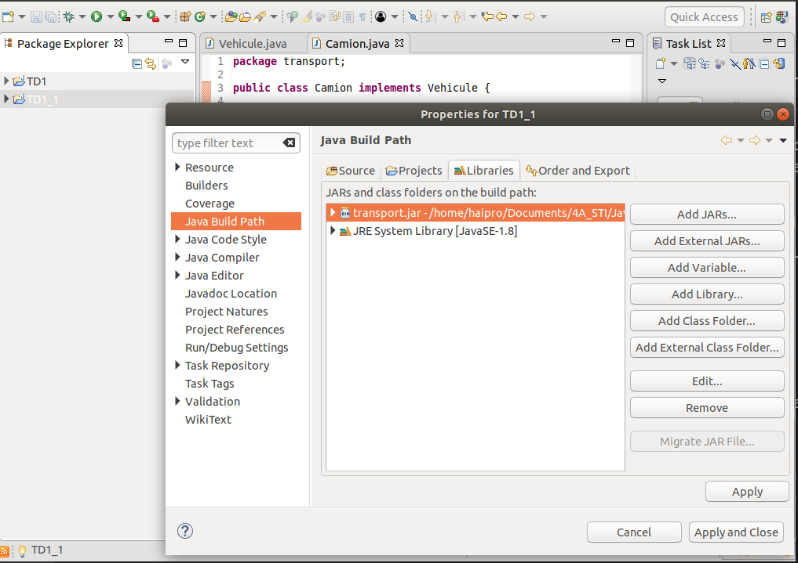
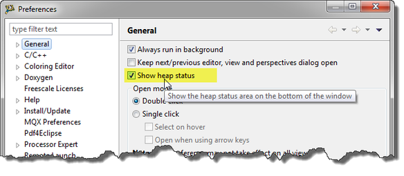

## Exo 1:
### Vehicule.java
```java
package transport;

public interface Vehicule {
	
}
```
### Camion.java
```java
package transport;

public class Camion implements Vehicule {
	
	private String nom_vehicule;
	public Camion(String nom_vehicule){
		this.nom_vehicule = nom_vehicule;
	}
	@Override
	public String toString() {
		return "Camion [nom_vehicule=" + nom_vehicule + "]";
	}
}

```

## Exo 2:
 J'ai cree le fichier transport.jar par:

 -  **File > Export > Create un jar file et obtenu transport.jar**
## Exo 3: 
- Voir l'image exo_3.png

- La main progamation: Main.java
```java
package transport;

import java.util.Vector;

public class Main {

	public static void main(String[] args) {
		// TODO Auto-generated method stub
		Camion c1 = new Camion("Renault");
		Camion c2 = new Camion("Toyata");
		Camion c3 = new Camion("Vinmart");
		//Creer nouveau vector
		Vector<Camion> car = new Vector<Camion>();
		car.addElement(c1);
		car.addElement(c2);
		car.addElement(c3);
		
		System.out.println("Marque:" + c1.toString());
		System.out.println("Marque:" + c2.toString());
		System.out.println("Marque:" + c3.toString());
	}
}

```
## Exo 4:
 Voir l'image exo_4.png
 
- Pour creer un jar executable , on fait comme ca: 
  
  1. *File -> Export*

  2. *Select Java -> Runnable JAR file* et exporter le fichier jar

## Exo 5:
 Des commandes lines pour faire:
 ```command
 javac -cp <Adresse_de_fichier_library_jar> Main.java
 java Main
 ```
 Par exemple dans mon ordinateur:
```
javac -cp /home/haipro/Documents/4A_STI/JavaAvance/TD1/transport.jar Main.java 
java Main
```
***Remarque***: Si on ne s'installe pas le jdk, on peut avoir un probleme:
 ```
 Command 'javac' not found, but can be installed with:

sudo apt install default-jdk            
sudo apt install openjdk-11-jdk-headless
sudo apt install ecj                    
sudo apt install openjdk-8-jdk-headless
 ```

 ## Exo 6:
La commande javap -c Camion.class donne le resultat comme ca:
 ```java
 public class transport.Camion implements transport.Vehicule {
  public transport.Camion(java.lang.String);
    Code:
       0: aload_0
       1: invokespecial #12                 // Method java/lang/Object."<init>":()V
       4: aload_0
       5: aload_1
       6: putfield      #15                 // Field nom_vehicule:Ljava/lang/String;
       9: return

  public java.lang.String toString();
    Code:
       0: new           #23                 // class java/lang/StringBuilder
       3: dup
       4: ldc           #25                 // String Camion [nom_vehicule=
       6: invokespecial #27                 // Method java/lang/StringBuilder."<init>":(Ljava/lang/String;)V
       9: aload_0
      10: getfield      #15                 // Field nom_vehicule:Ljava/lang/String;
      13: invokevirtual #29                 // Method java/lang/StringBuilder.append:(Ljava/lang/String;)Ljava/lang/StringBuilder;
      16: ldc           #33                 // String ]
      18: invokevirtual #29                 // Method java/lang/StringBuilder.append:(Ljava/lang/String;)Ljava/lang/StringBuilder;
      21: invokevirtual #35                 // Method java/lang/StringBuilder.toString:()Ljava/lang/String;
      24: areturn
 ```
 - Ou javap -c Vehicule.class:
  ```java
  // class version 52.0 (52)
// access flags 0x601
public abstract interface transport/Vehicule {

  // compiled from: Vehicule.java
}
```
- javap -c private Main.class:
```java
Compiled from "Main.java"
public class transport.Main {
  public transport.Main();
    Code:
       0: aload_0
       1: invokespecial #8                  // Method java/lang/Object."<init>":()V
       4: return

  public static void main(java.lang.String[]);
    Code:
       0: new           #16                 // class transport/Camion
       3: dup
       4: ldc           #18                 // String Renault
       6: invokespecial #20                 // Method transport/Camion."<init>":(Ljava/lang/String;)V
       9: astore_1
      10: new           #16                 // class transport/Camion
      13: dup
      14: ldc           #23                 // String Toyata
      16: invokespecial #20                 // Method transport/Camion."<init>":(Ljava/lang/String;)V
      19: astore_2
      20: new           #16                 // class transport/Camion
      23: dup
      24: ldc           #25                 // String Vinmart
      26: invokespecial #20                 // Method transport/Camion."<init>":(Ljava/lang/String;)V
      29: astore_3
      30: new           #27                 // class java/util/Vector
      33: dup
      34: invokespecial #29                 // Method java/util/Vector."<init>":()V
      37: astore        4
      39: aload         4
      41: aload_1
      42: invokevirtual #30                 // Method java/util/Vector.addElement:(Ljava/lang/Object;)V
      45: aload         4
      47: aload_2
      48: invokevirtual #30                 // Method java/util/Vector.addElement:(Ljava/lang/Object;)V
      51: aload         4
      53: aload_3
      54: invokevirtual #30                 // Method java/util/Vector.addElement:(Ljava/lang/Object;)V
      57: getstatic     #34                 // Field java/lang/System.out:Ljava/io/PrintStream;
      60: new           #40                 // class java/lang/StringBuilder
      63: dup
      64: ldc           #42                 // String Marque:
      66: invokespecial #44                 // Method java/lang/StringBuilder."<init>":(Ljava/lang/String;)V
      69: aload_1
      70: invokevirtual #45                 // Method transport/Camion.toString:()Ljava/lang/String;
      73: invokevirtual #49                 // Method java/lang/StringBuilder.append:(Ljava/lang/String;)Ljava/lang/StringBuilder;
      76: invokevirtual #53                 // Method java/lang/StringBuilder.toString:()Ljava/lang/String;
      79: invokevirtual #54                 // Method java/io/PrintStream.println:(Ljava/lang/String;)V
      82: getstatic     #34                 // Field java/lang/System.out:Ljava/io/PrintStream;
      85: new           #40                 // class java/lang/StringBuilder
      88: dup
      89: ldc           #42                 // String Marque:
      91: invokespecial #44                 // Method java/lang/StringBuilder."<init>":(Ljava/lang/String;)V
      94: aload_2
      95: invokevirtual #45                 // Method transport/Camion.toString:()Ljava/lang/String;
      98: invokevirtual #49                 // Method java/lang/StringBuilder.append:(Ljava/lang/String;)Ljava/lang/StringBuilder;
     101: invokevirtual #53                 // Method java/lang/StringBuilder.toString:()Ljava/lang/String;
     104: invokevirtual #54                 // Method java/io/PrintStream.println:(Ljava/lang/String;)V
     107: getstatic     #34                 // Field java/lang/System.out:Ljava/io/PrintStream;
     110: new           #40                 // class java/lang/StringBuilder
     113: dup
     114: ldc           #42                 // String Marque:
     116: invokespecial #44                 // Method java/lang/StringBuilder."<init>":(Ljava/lang/String;)V
     119: aload_3
     120: invokevirtual #45                 // Method transport/Camion.toString:()Ljava/lang/String;
     123: invokevirtual #49                 // Method java/lang/StringBuilder.append:(Ljava/lang/String;)Ljava/lang/StringBuilder;
     126: invokevirtual #53                 // Method java/lang/StringBuilder.toString:()Ljava/lang/String;
     129: invokevirtual #54                 // Method java/io/PrintStream.println:(Ljava/lang/String;)V
     132: return
}
```
## Exo 7:
Créez de nombeux véhicules numérotés, beaucoup, beaucoup, que vous placerez dans
votre Vector. De temps en temps, enlever des véhicules du Vector.
```java
for(int i = 0; i< 123456; i++) {
	car.add(new Camion("toto"));
}
```
En cette manière, on ajoute 123456 Camions avec ses marques "toto".

## Exo 8:
 
 On ajoute 3 lignes comme ca:
  ```java
  System.out.println("Used Memory   :  " + (Runtime.getRuntime().totalMemory()-Runtime.getRuntime().freeMemory()) + " bytes");
  
  System.out.println("Free Memory   : " + Runtime.getRuntime().freeMemory() + " bytes");
  
  System.out.println("Total Memory  : " + Runtime.getRuntime().totalMemory() + " bytes");
  ```

  - Et les resultats suivantes:
   
   ```
   Used Memory   :  1971352 bytes
   Free Memory   : 185199464 bytes
   Total Memory  : 187170816 bytes
   ```

   - Elles permettent de voir l'effet de l'utilisation du GC  sur la memoire
## Exo 9:
1. Pour affichier le Heap Memory, à l'aide du menu Fenêtre> Préférences, un paramètre que je peux activer est celui-ci: «Show heap status»:

2. Ajouter ce ligne pour vérifier la maximum value Heap Memory:
   ```java
      System.out.println("Max Memory: "+java.lang.Runtime.getRuntime().maxMemory()+ " bytes");
   ```
3. Pour augmenter la value Heap Memory, d'abord, vous devez configurer le fichier: eclipse.ini. Si le fichier eclipse.ini se trouve à un emplacement différent, vous pouvez le trouver comme suit (source):
    - Ouvrez Eclipse comme vous le faites normalement.
    - Cliquez sur Aide -> À propos d'Eclipse
    - Cliquez sur Détails de l'installation
    - Aller sur l'onglet Configuration
    - Trouvez eclipse.home.location = file: PATH. PATH est l'emplacement d'installation du fichier eclipse.ini.
4. On change comme ca:
   ```java
   -Xms256m --> -Xms512m
   ```
5. Redémarrer Eclipse
6. Resultat:
   - Avant:
   - Apres:
   