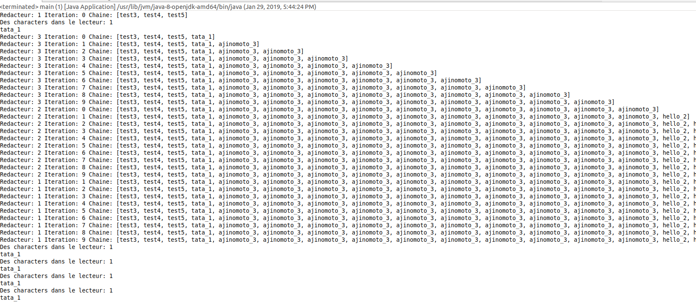
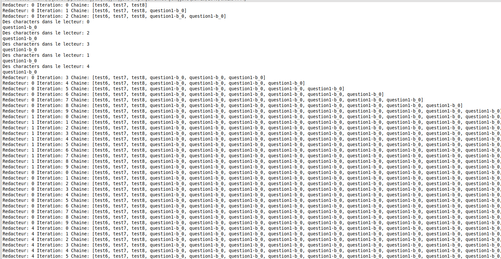

### Exercice 1-A

Resultat:

```java
Redacteur: 1 Iteration: 0 Chaine: [test3, test4, test5]
Des characters dans le lecteur: 1
tata_1
Redacteur: 3 Iteration: 0 Chaine: [test3, test4, test5, tata_1]
Redacteur: 3 Iteration: 1 Chaine: [test3, test4, test5, tata_1, ajinomoto_3]
Redacteur: 3 Iteration: 2 Chaine: [test3, test4, test5, tata_1, ajinomoto_3, ajinomoto_3]
Redacteur: 3 Iteration: 3 Chaine: [test3, test4, test5, tata_1, ajinomoto_3, ajinomoto_3, ajinomoto_3]
Redacteur: 3 Iteration: 4 Chaine: [test3, test4, test5, tata_1, ajinomoto_3, ajinomoto_3, ajinomoto_3, ajinomoto_3]
Redacteur: 3 Iteration: 5 Chaine: [test3, test4, test5, tata_1, ajinomoto_3, ajinomoto_3, ajinomoto_3, ajinomoto_3, ajinomoto_3]
Redacteur: 3 Iteration: 6 Chaine: [test3, test4, test5, tata_1, ajinomoto_3, ajinomoto_3, ajinomoto_3, ajinomoto_3, ajinomoto_3, ajinomoto_3]
Redacteur: 3 Iteration: 7 Chaine: [test3, test4, test5, tata_1, ajinomoto_3, ajinomoto_3, ajinomoto_3, ajinomoto_3, ajinomoto_3, ajinomoto_3, ajinomoto_3]
Redacteur: 3 Iteration: 8 Chaine: [test3, test4, test5, tata_1, ajinomoto_3, ajinomoto_3, ajinomoto_3, ajinomoto_3, ajinomoto_3, ajinomoto_3, ajinomoto_3, ajinomoto_3]
Redacteur: 3 Iteration: 9 Chaine: [test3, test4, test5, tata_1, ajinomoto_3, ajinomoto_3, ajinomoto_3, ajinomoto_3, ajinomoto_3, ajinomoto_3, ajinomoto_3, ajinomoto_3, ajinomoto_3]
Redacteur: 2 Iteration: 0 Chaine: [test3, test4, test5, tata_1, ajinomoto_3, ajinomoto_3, ajinomoto_3, ajinomoto_3, ajinomoto_3, ajinomoto_3, ajinomoto_3, ajinomoto_3, ajinomoto_3, ajinomoto_3]
Redacteur: 2 Iteration: 1 Chaine: [test3, test4, test5, tata_1, ajinomoto_3, ajinomoto_3, ajinomoto_3, ajinomoto_3, ajinomoto_3, ajinomoto_3, ajinomoto_3, ajinomoto_3, ajinomoto_3, ajinomoto_3, hello_2]
Redacteur: 2 Iteration: 2 Chaine: [test3, test4, test5, tata_1, ajinomoto_3, ajinomoto_3, ajinomoto_3, ajinomoto_3, ajinomoto_3, ajinomoto_3, ajinomoto_3, ajinomoto_3, ajinomoto_3, ajinomoto_3, hello_2, hello_2]
Redacteur: 2 Iteration: 3 Chaine: [test3, test4, test5, tata_1, ajinomoto_3, ajinomoto_3, ajinomoto_3, ajinomoto_3, ajinomoto_3, ajinomoto_3, ajinomoto_3, ajinomoto_3, ajinomoto_3, ajinomoto_3, hello_2, hello_2, hello_2]
Redacteur: 2 Iteration: 4 Chaine: [test3, test4, test5, tata_1, ajinomoto_3, ajinomoto_3, ajinomoto_3, ajinomoto_3, ajinomoto_3, ajinomoto_3, ajinomoto_3, ajinomoto_3, ajinomoto_3, ajinomoto_3, hello_2, hello_2, hello_2, hello_2]
Redacteur: 2 Iteration: 5 Chaine: [test3, test4, test5, tata_1, ajinomoto_3, ajinomoto_3, ajinomoto_3, ajinomoto_3, ajinomoto_3, ajinomoto_3, ajinomoto_3, ajinomoto_3, ajinomoto_3, ajinomoto_3, hello_2, hello_2, hello_2, hello_2, hello_2]
Redacteur: 2 Iteration: 6 Chaine: [test3, test4, test5, tata_1, ajinomoto_3, ajinomoto_3, ajinomoto_3, ajinomoto_3, ajinomoto_3, ajinomoto_3, ajinomoto_3, ajinomoto_3, ajinomoto_3, ajinomoto_3, hello_2, hello_2, hello_2, hello_2, hello_2, hello_2]
Redacteur: 2 Iteration: 7 Chaine: [test3, test4, test5, tata_1, ajinomoto_3, ajinomoto_3, ajinomoto_3, ajinomoto_3, ajinomoto_3, ajinomoto_3, ajinomoto_3, ajinomoto_3, ajinomoto_3, ajinomoto_3, hello_2, hello_2, hello_2, hello_2, hello_2, hello_2, hello_2]
Redacteur: 2 Iteration: 8 Chaine: [test3, test4, test5, tata_1, ajinomoto_3, ajinomoto_3, ajinomoto_3, ajinomoto_3, ajinomoto_3, ajinomoto_3, ajinomoto_3, ajinomoto_3, ajinomoto_3, ajinomoto_3, hello_2, hello_2, hello_2, hello_2, hello_2, hello_2, hello_2, hello_2]
Redacteur: 2 Iteration: 9 Chaine: [test3, test4, test5, tata_1, ajinomoto_3, ajinomoto_3, ajinomoto_3, ajinomoto_3, ajinomoto_3, ajinomoto_3, ajinomoto_3, ajinomoto_3, ajinomoto_3, ajinomoto_3, hello_2, hello_2, hello_2, hello_2, hello_2, hello_2, hello_2, hello_2, hello_2]
Redacteur: 1 Iteration: 1 Chaine: [test3, test4, test5, tata_1, ajinomoto_3, ajinomoto_3, ajinomoto_3, ajinomoto_3, ajinomoto_3, ajinomoto_3, ajinomoto_3, ajinomoto_3, ajinomoto_3, ajinomoto_3, hello_2, hello_2, hello_2, hello_2, hello_2, hello_2, hello_2, hello_2, hello_2, hello_2]
Redacteur: 1 Iteration: 2 Chaine: [test3, test4, test5, tata_1, ajinomoto_3, ajinomoto_3, ajinomoto_3, ajinomoto_3, ajinomoto_3, ajinomoto_3, ajinomoto_3, ajinomoto_3, ajinomoto_3, ajinomoto_3, hello_2, hello_2, hello_2, hello_2, hello_2, hello_2, hello_2, hello_2, hello_2, hello_2, tata_1]
Redacteur: 1 Iteration: 3 Chaine: [test3, test4, test5, tata_1, ajinomoto_3, ajinomoto_3, ajinomoto_3, ajinomoto_3, ajinomoto_3, ajinomoto_3, ajinomoto_3, ajinomoto_3, ajinomoto_3, ajinomoto_3, hello_2, hello_2, hello_2, hello_2, hello_2, hello_2, hello_2, hello_2, hello_2, hello_2, tata_1, tata_1]
Redacteur: 1 Iteration: 4 Chaine: [test3, test4, test5, tata_1, ajinomoto_3, ajinomoto_3, ajinomoto_3, ajinomoto_3, ajinomoto_3, ajinomoto_3, ajinomoto_3, ajinomoto_3, ajinomoto_3, ajinomoto_3, hello_2, hello_2, hello_2, hello_2, hello_2, hello_2, hello_2, hello_2, hello_2, hello_2, tata_1, tata_1, tata_1]
Redacteur: 1 Iteration: 5 Chaine: [test3, test4, test5, tata_1, ajinomoto_3, ajinomoto_3, ajinomoto_3, ajinomoto_3, ajinomoto_3, ajinomoto_3, ajinomoto_3, ajinomoto_3, ajinomoto_3, ajinomoto_3, hello_2, hello_2, hello_2, hello_2, hello_2, hello_2, hello_2, hello_2, hello_2, hello_2, tata_1, tata_1, tata_1, tata_1]
Redacteur: 1 Iteration: 6 Chaine: [test3, test4, test5, tata_1, ajinomoto_3, ajinomoto_3, ajinomoto_3, ajinomoto_3, ajinomoto_3, ajinomoto_3, ajinomoto_3, ajinomoto_3, ajinomoto_3, ajinomoto_3, hello_2, hello_2, hello_2, hello_2, hello_2, hello_2, hello_2, hello_2, hello_2, hello_2, tata_1, tata_1, tata_1, tata_1, tata_1]
Redacteur: 1 Iteration: 7 Chaine: [test3, test4, test5, tata_1, ajinomoto_3, ajinomoto_3, ajinomoto_3, ajinomoto_3, ajinomoto_3, ajinomoto_3, ajinomoto_3, ajinomoto_3, ajinomoto_3, ajinomoto_3, hello_2, hello_2, hello_2, hello_2, hello_2, hello_2, hello_2, hello_2, hello_2, hello_2, tata_1, tata_1, tata_1, tata_1, tata_1, tata_1]
Redacteur: 1 Iteration: 8 Chaine: [test3, test4, test5, tata_1, ajinomoto_3, ajinomoto_3, ajinomoto_3, ajinomoto_3, ajinomoto_3, ajinomoto_3, ajinomoto_3, ajinomoto_3, ajinomoto_3, ajinomoto_3, hello_2, hello_2, hello_2, hello_2, hello_2, hello_2, hello_2, hello_2, hello_2, hello_2, tata_1, tata_1, tata_1, tata_1, tata_1, tata_1, tata_1]
Redacteur: 1 Iteration: 9 Chaine: [test3, test4, test5, tata_1, ajinomoto_3, ajinomoto_3, ajinomoto_3, ajinomoto_3, ajinomoto_3, ajinomoto_3, ajinomoto_3, ajinomoto_3, ajinomoto_3, ajinomoto_3, hello_2, hello_2, hello_2, hello_2, hello_2, hello_2, hello_2, hello_2, hello_2, hello_2, tata_1, tata_1, tata_1, tata_1, tata_1, tata_1, tata_1, tata_1]
Des characters dans le lecteur: 1
tata_1
Des characters dans le lecteur: 1
tata_1
Des characters dans le lecteur: 1
tata_1
Des characters dans le lecteur: 1
tata_1
```


### Exercice 1-b

